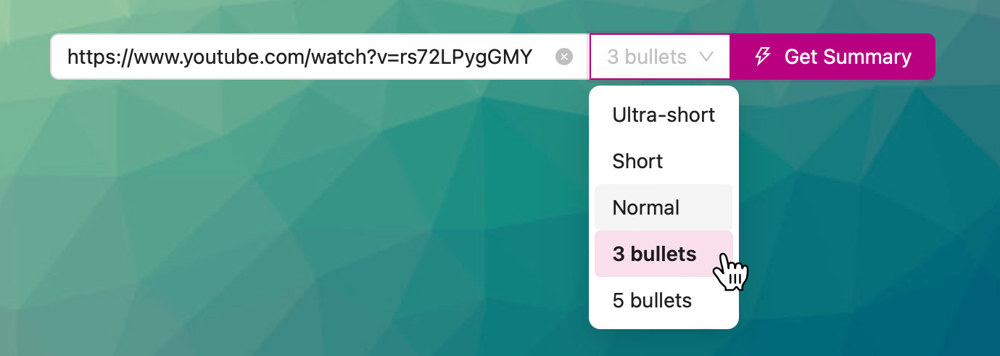

Get a summary of a youtube video using AI. Check the [demo](https://yt-summary-next.vercel.app/).

## Getting Started

Do you need a **YouTube Data API v3** key & a **Generative Language API** key.

Create an environment file `cp .env.example .env.local` and set the following variables:

- **NEXT_PUBLIC_GOOGLE_API_KEY** is the API key for Google (Generative Language API).
- **NEXT_PUBLIC_YOUTUBE_API_KEY** is the API key for Google (YouTube Data API v3).

Run the development server: `npm run dev`

<video src="https://www.visitanyplace.com/github/yt-summary/demo.mp4" width="352" height="720" controls></video>

## TODO

- limit the AI request (Google Gemini API)
- select the AI model
- use only free AI models (??)
- prevent (by IP?) multiple requests to the AI
- switch between AI models & providers (Google, OpenAI)
- restrict the amount of chars to be processed by the AI ($)
- make more responsive
- change style & add instructions
- add related/more video links
- add getparam to work (video ID as query param)
- show more info about the video
- add 3 more options: 3 most important points, 5 most important points & a custom prompt (in a modal)
- sort voices by language

## FIXME

- play/stop status (when finish playing, it should change state)
- Voice in mobile (when no voice found)
